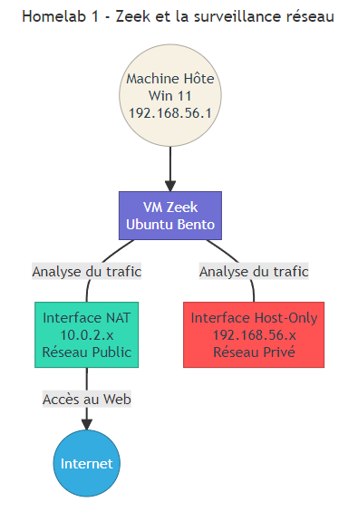

# Homelab 1 : Zeek – Surveillance du Réseau

## Qu’est-ce que Zeek ?

**Zeek** (anciennement appelé **Bro**) est un **moteur d’analyse de trafic réseau** open-source. Il se distingue de nombreux autres outils de capture en se focalisant moins sur l’inspection bas niveau des paquets et davantage sur l’**analyse comportementale** de la session. Zeek génère des **logs riches** (`DNS`, `HTTP`, `SSL/TLS`, etc.) qui fournissent une `vision complète des échanges réseau` et peuvent être exploités pour la **détection** et la **corrélation** d’événements de sécurité.

> Documentation officielle : [https://docs.zeek.org](https://docs.zeek.org)

<br>

---

<br>

## Introduction

Ce premier **homelab** a pour but de déployer **`Zeek`** afin d’établir une **surveillance approfondie** du trafic réseau. Les informations que Zeek va fournir serviront de **base** pour les futures briques de sécurité (`IDS`, `IPS`, `SIEM`, etc.).

<br>

---

<br>

## Sommaire

- [Homelab 1 : Zeek – Surveillance du Réseau](#homelab-1--zeek--surveillance-du-réseau)
  - [Qu’est-ce que Zeek ?](#quest-ce-que-zeek-)
  - [Introduction](#introduction)
  - [Sommaire](#sommaire)
  - [Objectifs](#objectifs)
  - [Prérequis spécifiques](#prérequis-spécifiques)
  - [Architecture globale du Homelab 1](#architecture-globale-du-homelab-1)
  - [Étapes de déploiement](#étapes-de-déploiement)

<br>

---

<br>

## Objectifs

1. **Installer** Zeek sur une machine virtuelle Ubuntu 20.04 (`Bento`) via Vagrant.
2. **Comprendre** les composants principaux de Zeek (`fichiers de configuration`, `scripts`, `logs`).
3. **Surveiller** le trafic réseau local (`NAT` ou `bridged`) pour collecter des métadonnées.
4. **Préparer** le socle pour l’intégration avec d’autres composants (`Suricata`, `Snort`, `Wazuh`, etc.) dans les homelabs suivants.

<br>

---

<br>

## Prérequis spécifiques

-   **Vagrant** et **VirtualBox** opérationnels.
-   **Git** (pour cloner ce dépôt, si ce n’est pas déjà fait).
-   Accès internet pour récupérer les paquets et dépendances nécessaires à l’installation de Zeek.

Mon système hôte est une machine **Windows 11** avec **32 Go** de RAM et un **Intel(R) Core(TM) i5-10600KF**, ce qui est **amplement suffisant** pour exécuter ce homelab. Néanmoins, si je rencontre des soucis de performances, je peux ajuster la configuration (`RAM`, `vCPU`) de la VM dans le **Vagrantfile**.

<br>

---

<br>

## Architecture globale du Homelab 1

<br>



-   **Machine Hôte (Win 11)**  
    J’ai installé **VirtualBox** et **Vagrant** sur mon **ordinateur principal**, sous **Windows 11**. C’est depuis cette machine que je gère le lancement et la configuration de mes différentes VMs. Ici, je lance la VM **Zeek**.

-   **VM Zeek**  
    J’ai configuré deux **interfaces réseau** :
    1. **NAT** pour assurer l’accès internet depuis la VM, tout en restant masquée derrière l’hôte.
    2. **Host-Only** pour créer un **réseau privé** entre la machine hôte et la VM. Ainsi, Zeek peut analyser le trafic sur ce réseau interne, sans être directement exposé au LAN de l’hôte.

<br>

---

<br>

## Étapes de déploiement

```bash
# 1 - Cloner le dépôt (si ce n’est pas fait)
git clone https://votre-depot.git/homelab-soc-cybersecurity

# 2 - Aller dans le répertoire Zeek
cd homelab-soc-cybersecurity/homelab_1-zeek

# 3 - Lancer le déploiement de la VM
vagrant up
```

_Le fichier **Vagrantfile** fournit la configuration nécessaire (`image Bento Ubuntu`, `ressources CPU/RAM`, `provisionnement`, etc.)._

```bash
# 4 - Connexion SSH
vagrant ssh

# 5 - Attention au mot de passe, il s'agit de "vagrant" mais en QWERTY je saisi :
vqgrqnt
```

<br>

---

<br>

<br>

---

<br>

<br>

---

<br>

<br>

---

<br>
